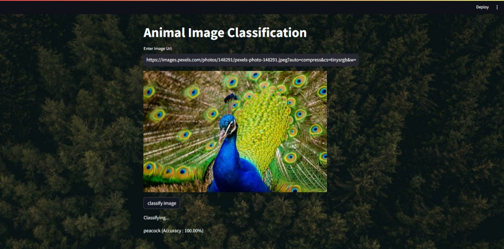

# Animal-Image-Classification
Animal Image Classification project could use deep learning techniques to train a model that identifies animals in pictures. This could be
useful for tasks like wildlife conservation or automated species identification.

1

2

3

4

